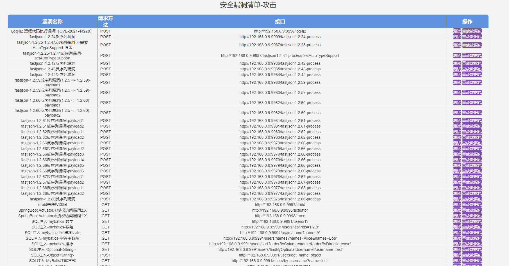
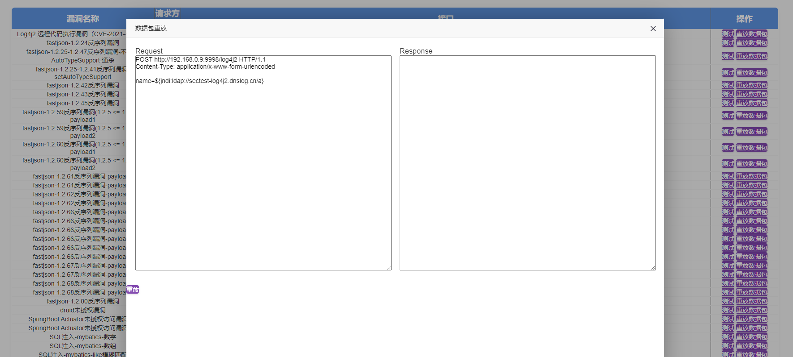

# JavaVul


## 介绍

Java 安全漏洞靶场，用于测试IAST和扫描器的被动扫描功能，集合了多个安全漏洞，利用docker镜像为每个靶场独立环境运行。

文章：[IAST实践总结](https://mp.weixin.qq.com/s/ahxKXv5eKcULVF_VqAjbyg)

## 部署

mvn版本

```sh
# mvn --version
Apache Maven 3.0.5 (Red Hat 3.0.5-17)
Maven home: /usr/share/maven
Java version: 1.8.0_192, vendor: Oracle Corporation
Java home: /usr/java/jdk1.8.0_192/jre
Default locale: en_US, platform encoding: UTF-8
OS name: "linux", version: "3.10.0-1160.el7.x86_64", arch: "amd64", family: "unix"
```

docker和docker-compose版本

```sh
# docker version
Client:
 Version:         1.13.1
 API version:     1.26
 Package version: docker-1.13.1-209.git7d71120.el7.centos.x86_64
 Go version:      go1.10.3
 Git commit:      7d71120/1.13.1
 Built:           Wed Mar  2 15:25:43 2022
 OS/Arch:         linux/amd64

Server:
 Version:         1.13.1
 API version:     1.26 (minimum version 1.12)
 Package version: docker-1.13.1-209.git7d71120.el7.centos.x86_64
 Go version:      go1.10.3
 Git commit:      7d71120/1.13.1
 Built:           Wed Mar  2 15:25:43 2022
 OS/Arch:         linux/amd64
 Experimental:    false

# docker-compose version
docker-compose version 1.18.0, build 8dd22a9
docker-py version: 2.6.1
CPython version: 3.6.8
OpenSSL version: OpenSSL 1.0.2k-fips  26 Jan 2017
```

> 默认docker和docker-compose太低，需要安装比较新的
>
> ```
>  yum remove docker \
>               docker-client \
>               docker-client-latest \
>               docker-common \
>               docker-latest \
>               docker-latest-logrotate \
>               docker-logrotate \
>               docker-engine
> 
> sudo yum install -y yum-utils
> sudo yum-config-manager --add-repo https://download.docker.com/linux/centos/docker-ce.repo
> 
> sudo yum install docker-ce docker-ce-cli containerd.io docker-buildx-plugin docker-compose-plugin docker-compose
> ```

下载项目

```sh
git clone https://github.com/lokerxx/JavaVul
```

以下是运行脚本：

|            文件            |                             作用                             |            运行            |
| :------------------------: | :----------------------------------------------------------: | :------------------------: |
| docker-compose-build.yaml  | 在容器里面构建jar包，每个靶场构建会重复构建（**构建速度会很慢，不建议**） | `bash run-build_images.sh` |
| docker-compose-local.yaml  | 宿主机maven构建各个靶场的jar包，多个靶场可以基于maven缓存快速构建（**推荐**） | `bash run-local-build.sh`  |
| docker-compose-remote.yaml | 直接去dockerhub下载我构建上传成功的镜像（**镜像更新不及时**） |    `bash run-remote.sh`    |

> 此外，需修改yaml文件里面`flask.environment.HOST`为宿主机的IP，用于跑测试用例。**然后我在yaml文件已经默认挂载agent.jar**，如果你们要测试IAST agent功能，直接替换到`agent/agent.jar`即可。我这边自己写了一个简单的java agent，参考下面[SimpleAgent]()

> 如果要测试被动代理扫描，需要修改`index/app.py`里面`proxy_mode`为`True`，修改自己的代理地址：`proxies`

> **修改完成之后，根据自己的需求，运行上面表格的sh脚本部署运行即可**。

> 因为漏洞应用比较多**但是接口比较少**，我给每个应用配置512-1024M内存（测试运行要16G内存）。如果要配置大一点测试 IAST AGENT，则可以批量修改`docker-compose.yaml`的`-Xms512m -Xmx1024m`的环境变量

> 基本web漏洞的代码审计的细节，参考这里：https://github.com/lokerxx/CybersecurityNote/tree/master/%E4%BB%A3%E7%A0%81%E5%AE%A1%E8%AE%A1/JAVA%E6%BC%8F%E6%B4%9E


### 压力测试

部署运行

|              文件               |                         作用                         |          运行          |
| :-----------------------------: | :--------------------------------------------------: | :--------------------: |
| docker-compose-microservice.yml | 运行多个springcloud微服务，用于测试多链路 IAST agent | `run-local-service.sh` |

测试用例

| 接口                                            | 压测命令                                                     |
| ----------------------------------------------- | ------------------------------------------------------------ |
| http://ip:29998/process-user-data?userData=test | ` ab -n 1000 -c 20 "http://IP:29998/process-user-data?userData=test"` |


## 运行

访问：`http://宿主机IP:5000/`

我配置了三种模式：

- 攻击：发送一些payload，触发漏洞
- 正常：有可能是漏洞，但是发送是正常的数据
- 修复：漏洞已经修复，但是payload不生效（过滤或者报错）
- 误报：IAST或SAST误报检测的安全漏洞

其中右边测试按钮，可以对这个接口进行用例测试。



也可以自定义发送payload，进行调试



也可以批量发送请求，各个漏洞的回显，会在下面显示。


## SimpleAgent

Java Agent 是一种工具，它可以使用 Java Instrumentation API 在运行时修改字节码。一个非常简单的 Java Agent 可以仅仅记录一个消息，以表明它已被加载。

首先，创建 Agent 类 `SimpleAgent.java`：

```java
package my.agent;

import java.lang.instrument.Instrumentation;

public class SimpleAgent {
    public static void premain(String agentArgs, Instrumentation inst) {
        System.out.println("SimpleAgent 已加载");
    }
}
```

在这段代码中，`premain` 方法是 Java Agent 的入口点。它在应用程序的 `main` 方法之前被调用。

接下来，你需要一个 manifest 文件来指定 Agent-Class。创建一个名为 `MANIFEST.MF` 的文件，内容如下：

```
Manifest-Version: 1.0
Premain-Class: my.agent.SimpleAgent
Can-Redefine-Classes: true
Can-Retransform-Classes: true
```

这个 manifest 文件指定了 agent 类并启用了一些功能，如类的重定义和重转换。

现在，将 Java Agent 编译并打包成 JAR 文件。假设你的 Java 文件在 `src` 目录中，使用 `javac` 和 `jar` 命令，你可以这样做：

1. 编译 agent 类：

```sh
# javac -source 1.8 -target 1.8 -d . src/main/java/my/agent/SimpleAgent.java
```

2. 将编译后的类打包成带有 manifest 的 JAR 文件：

```sh
# jar cvfm SimpleAgent.jar MANIFEST.MF my/agent/SimpleAgent.class
added manifest
adding: my/agent/SimpleAgent.class(in = 492) (out= 320)(deflated 34%)
```

现在你有了一个可以作为 Java Agent 使用的 `SimpleAgent.jar`。要将这个 agent 附加到你的应用程序上，启动 Java 应用程序时使用 `-javaagent` 选项，将`SimpleAgent.jar`重命名到`./agent/agent.jar`

```sh
# mv SimpleAgent.jar ../agent/agent.jar
```


## 支持测试的漏洞

| 接口 | 漏洞名字 | 请求方法 | url | 接口类型 |
| :----------------------------------------: | :---------------------------------------------------------: | -------- | :----------------------------------------------------------: | :------: |
| druid_authorized | druid未授权漏洞 | GET | http://192.168.0.9:9996/druid | 修复 |
| actuator2_authorized | SpringBoot Actuator未授权访问漏洞2.X | GET | http://192.168.0.9:9994/actuator | 修复 |
| actuator1_authorized | SpringBoot Actuator未授权访问漏洞1.X | GET | http://192.168.0.9:9992/trace | 修复 |
| sql_injection_id_repair | SQL注入-mybatics-数字 | GET | http://192.168.0.9:9990/users/1'/ | 修复 |
| sql_injection_ids_repair | SQL注入-mybatics-数组 | GET | http://192.168.0.9:9990/users/ids/?ids=1,2,3' | 修复 |
| sql_injection_like_repair | SQL注入-mybatics-like模糊匹配 | GET | http://192.168.0.9:9990/users/name?name=A' | 修复 |
| sql_injection_strs_repair | SQL注入-mybatics-字符串数组 | GET | http://192.168.0.9:9990/users/names?names=Alice&names=Bob' | 修复 |
| sql_injection_orderby_repair | SQL注入-mybatics-排序 | GET | http://192.168.0.9:9990/users/sort?orderByColumn=name&orderByDirection=asc' | 修复 |
| xss_reflect_htmlEscape_repair | 反射型XSS漏洞-htmlEscape类 | GET | http://192.168.0.9:9990/xss_reflect_htmlEscape?name=<script>alert(123)</script> | 修复 |
| xss_reflect_escapeHtml4_repair | 反射型XSS漏洞-escapeHtml4类 | GET | http://192.168.0.9:9990/xss_reflect_escapeHtml4?name=<script>alert(123)</script> | 修复 |
| xss_reflect_escapeHtml_reparir | 反射型XSS漏洞-html编码 | GET | http://192.168.0.9:9990/xss_reflect_escapeHtml?name=<script>alert(123)</script> | 修复 |
| xss_storage_thymeleaf_reparir | 存储型XSS漏洞-thymeleaf模板过滤 | GET | http://192.168.0.9:9990/xss_storage_thymeleaf?name=<script>alert(123)</script> | 修复 |
| file_upload_repair | 任意文件上传漏洞 | POST | http://192.168.0.9:9990/file_upload | 修复 |
| file_read_repair | 文件读取漏洞 | GET | http://192.168.0.9:9990/file_read?filePath=pom.xml | 修复 |
| file_write_repair | 任意文件写入漏洞 | GET | http://192.168.0.9:9990/file_write?fileName=test.txt&data=test | 修复 |
| file_download_repair | 任意文件下载漏洞 | GET | http://192.168.0.9:9990/file_download?fileName=../test.log | 修复 |
| file_delete_repair | 任意文件删除漏洞 | GET | http://192.168.0.9:9990/file_delete?fileName=test.txt | 修复 |
| runtime_command_execute_repair | 命令执行漏洞-Runtime | GET | http://192.168.0.9:9990/runtime_command_execute?command=whoami | 修复 |
| process_builder_command_repair | 命令执行漏洞-ProcessBuilder | GET | http://192.168.0.9:9990/process_builder_command_execute?command=whoami | 修复 |
| crlf_injection_repair | CRLF注入 | GET | http://192.168.0.9:9990/crlf_injection?name=%0D%0ASet-Cookie: sessionid=123456 | 修复 |
| spel_expression_repair | SPEL表达式攻击 | GET | http://192.168.0.9:9990/spel_expression?input=T(java.lang.Runtime).getRuntime().exec('whoami') | 修复 |
| ssrf_openStream_repair | SSRF攻击-openStream | GET | http://192.168.0.9:9990/ssrf_openStream?url=https://www.baidu.com | 修复 |
| ssrf_openConnection_repair | SSRF攻击-openConnection | GET | http://192.168.0.9:9990/ssrf_openConnection?url=http://www.baidu.com | 修复 |
| ssrf_requestGet_repair | SSRF攻击-requestGet | GET | http://192.168.0.9:9990/ssrf_requestGet?url=http://www.baidu.com | 修复 |
| ssrf_okhttp_repair | SSRF攻击-okhttp | GET | http://192.168.0.9:9990/ssrf_okhttp?url=http://www.baidu.com | 修复 |
| ssrf_defaultHttpClient_repair | SSRF攻击-defaultHttpClient | GET | http://192.168.0.9:9990/ssrf_defaultHttpClient?url=http://www.baidu.com | 修复 |
| ssti_velocity_repair | SSTI攻击-velocity | GET | http://192.168.0.9:9990/ssti_velocity?content=%23set (%24exp %3d "exp")%3b%24exp.getClass().forName("java.lang.Runtime").getRuntime().exec("whoami") | 修复 |
| xxe_saxparserfactory_repair | XXE-saxparserfactory | POST | http://192.168.0.9:9990/xxe_saxparserfactory | 修复 |
| xxe_xmlreaderfactory_repair | XXE-xmlreaderfactory | POST | http://192.168.0.9:9990/xxe_xmlreaderfactory | 修复 |
| xxe_saxbuilder_repair | XXE-saxbuilder | POST | http://192.168.0.9:9990/xxe_saxbuilder | 修复 |
| xxe_saxreader_repair | XXE-saxreader | POST | http://192.168.0.9:9990/xxe_saxreader | 修复 |
| xxe_documentbuilderfactory_repair | XXE-documentbuilderfactory | POST | http://192.168.0.9:9990/xxe_documentbuilderfactory | 修复 |
| xxe_documentbuilderfactory_xinclude_repair | XXE-documentbuilderfactory_xinclude | POST | http://192.168.0.9:9990/xxe_documentbuilderfactory_xinclude | 修复 |
| OpenRedirector_ModelAndView_repair | URL重定向漏洞-ModelAndView | GET | http://192.168.0.9:9990/OpenRedirector_ModelAndView?url=https://www.baidu.com | 修复 |
| OpenRedirector_sendRedirect_repair | URL重定向漏洞-sendRedirect | GET | http://192.168.0.9:9990/OpenRedirector_sendRedirect?url=https://www.baidu.com | 修复 |
| OpenRedirector_lacation_repair | URL重定向漏洞-location | GET | http://192.168.0.9:9990/OpenRedirector_lacation?url=https://www.baidu.com | 修复 |
| swagger-ui_repair | swagger-ui-未授权访问漏洞 | GET | http://192.168.0.9:9990/swagger-ui.html | 修复 |
| sql_injection_Optional_repair | SQL注入-Optional<String> | GET | http://192.168.0.9:9990/users/findByOptionalUsername?username=test' | 修复 |
| sql_injection_Object_repair | SQL注入-Object[] | POST | http://192.168.0.9:9990/users/get_name_object | 修复 |
| sql_injection_Annotation_repair | SQL注入-MyBatis注解方式 | GET | http://192.168.0.9:9990/users/by-username?name=test | 修复 |
| sql_injection_lombok_repair | SQL注入-lombok | POST | http://192.168.0.9:9990/users/lombok | 修复 |
| sql_injection_hsqldb_repair | SQL注入-hsqldb | GET | http://192.168.0.9:9989/hsqldb_repair?username=1' | 修复 |
| sql_injection_Hibernate_repair | SQL注入-Hibernate | GET | http://192.168.0.9:9988/Hibernate_injection_repair?username=foobar' OR (SELECT COUNT(*) FROM User)>=0 OR 'foobar'=' | 修复 |
| log4j2_attack | Log4j2 远程代码执行漏洞（CVE-2021-44228） | POST | http://192.168.0.9:9998/log4j2 | 攻击 |
| fastjson1_2_24_attack | fastjson-1.2.24反序列漏洞 | POST | http://192.168.0.9:9999/fastjson1.2.24-process | 攻击 |
| fastjson1_2_25_attack | fastjson-1.2.25-1.2.47反序列漏洞-不需要AutoTypeSupport-通杀 | POST | http://192.168.0.9:9987/fastjson1.2.25-process | 攻击 |
| fastjson1_2_41_attack | fastjson-1.2.25-1.2.41反序列漏洞-setAutoTypeSupport | POST | http://192.168.0.9:9987/fastjson1.2.41-process-setAutoTypeSupport | 攻击 |
| fastjson1_2_42_attack | fastjson-1.2.42反序列漏洞 | POST | http://192.168.0.9:9986/fastjson1.2.42-process | 攻击 |
| fastjson1_2_43_attack | fastjson-1.2.43反序列漏洞 | POST | http://192.168.0.9:9985/fastjson1.2.43-process | 攻击 |
| fastjson1_2_45_attack | fastjson-1.2.45反序列漏洞 | POST | http://192.168.0.9:9984/fastjson1.2.45-process | 攻击 |
| fastjson1_2_59_attack_1 | fastjson-1.2.59反序列漏洞(1.2.5 <= 1.2.59)-payload1 | POST | http://192.168.0.9:9983/fastjson1.2.59-process | 攻击 |
| fastjson1_2_59_attack_2 | fastjson-1.2.59反序列漏洞(1.2.5 <= 1.2.59)-payload2 | POST | http://192.168.0.9:9983/fastjson1.2.59-process | 攻击 |
| fastjson1_2_60_attack_1 | fastjson-1.2.60反序列漏洞(1.2.5 <= 1.2.60)-payload1 | POST | http://192.168.0.9:9982/fastjson1.2.60-process | 攻击 |
| fastjson1_2_60_attack_2 | fastjson-1.2.60反序列漏洞(1.2.5 <= 1.2.60)-payload2 | POST | http://192.168.0.9:9982/fastjson1.2.60-process | 攻击 |
| fastjson1_2_61_attack_1 | fastjson-1.2.61反序列漏洞-payload1 | POST | http://192.168.0.9:9981/fastjson1.2.61-process | 攻击 |
| fastjson1_2_61_attack_2 | fastjson-1.2.61反序列漏洞-payload2 | POST | http://192.168.0.9:9981/fastjson1.2.61-process | 攻击 |
| fastjson1_2_62_attack_1 | fastjson-1.2.62反序列漏洞-payload1 | POST | http://192.168.0.9:9980/fastjson1.2.62-process | 攻击 |
| fastjson1_2_62_attack_2 | fastjson-1.2.62反序列漏洞-payload2 | POST | http://192.168.0.9:9980/fastjson1.2.62-process | 攻击 |
| fastjson1_2_66_attack_1 | fastjson-1.2.66反序列漏洞-payload1 | POST | http://192.168.0.9:9979/fastjson1.2.66-process | 攻击 |
| fastjson1_2_66_attack_2 | fastjson-1.2.66反序列漏洞-payload2 | POST | http://192.168.0.9:9979/fastjson1.2.66-process | 攻击 |
| fastjson1_2_66_attack_3 | fastjson-1.2.66反序列漏洞-payload3 | POST | http://192.168.0.9:9979/fastjson1.2.66-process | 攻击 |
| fastjson1_2_66_attack_4 | fastjson-1.2.66反序列漏洞-payload4 | POST | http://192.168.0.9:9979/fastjson1.2.66-process | 攻击 |
| fastjson1_2_66_attack_5 | fastjson-1.2.66反序列漏洞-payload5 | POST | http://192.168.0.9:9979/fastjson1.2.66-process | 攻击 |
| fastjson1_2_66_attack_6 | fastjson-1.2.66反序列漏洞-payload6 | POST | http://192.168.0.9:9979/fastjson1.2.66-process | 攻击 |
| fastjson1_2_67_attack_1 | fastjson-1.2.67反序列漏洞-payload1 | POST | http://192.168.0.9:9978/fastjson1.2.67-process | 攻击 |
| fastjson1_2_67_attack_2 | fastjson-1.2.67反序列漏洞-payload2 | POST | http://192.168.0.9:9978/fastjson1.2.67-process | 攻击 |
| fastjson1_2_68_attack_1 | fastjson-1.2.68反序列漏洞-payload1 | POST | http://192.168.0.9:9977/fastjson1.2.68-process | 攻击 |
| fastjson1_2_68_attack_2 | fastjson-1.2.68反序列漏洞-payload2 | POST | http://192.168.0.9:9977/fastjson1.2.68-process | 攻击 |
| fastjson1_2_80_attack | fastjson-1.2.80反序列漏洞 | POST | http://192.168.0.9:9976/fastjson1.2.80-process | 攻击 |
| druid_unauthorized | druid未授权漏洞 | GET | http://192.168.0.9:9997/druid | 攻击 |
| actuator2_unauthorized | SpringBoot Actuator未授权访问漏洞2.X | GET | http://192.168.0.9:9995/actuator | 攻击 |
| actuator1_unauthorized | SpringBoot Actuator未授权访问漏洞1.X | GET | http://192.168.0.9:9993/trace | 攻击 |
| sql_injection_id_attack | SQL注入-mybatics-数字 | GET | http://192.168.0.9:9991/users/1'/ | 攻击 |
| sql_injection_ids_attack | SQL注入-mybatics-数组 | GET | http://192.168.0.9:9991/users/ids/?ids=1,2,3' | 攻击 |
| sql_injection_like_attack | SQL注入-mybatics-like模糊匹配 | GET | http://192.168.0.9:9991/users/name?name=A' | 攻击 |
| sql_injection_strs_attack | SQL注入-mybatics-字符串数组 | GET | http://192.168.0.9:9991/users/names?names=Alice&names=Bob' | 攻击 |
| sql_injection_orderby_attack | SQL注入-mybatics-排序 | GET | http://192.168.0.9:9991/users/sort?orderByColumn=name&orderByDirection=asc' | 攻击 |
| sql_injection_Optional_attack | SQL注入-Optional<String> | GET | http://192.168.0.9:9991/users/findByOptionalUsername?username=test' | 攻击 |
| sql_injection_Object_attack | SQL注入-Object<String> | POST | http://192.168.0.9:9991/users/get_name_object | 攻击 |
| sql_injection_Annotation_attack | SQL注入-MyBatis注解方式 | GET | http://192.168.0.9:9991/users/by-username?name=test' | 攻击 |
| sql_injection_lombok_attack | SQL注入-lombok | POST | http://192.168.0.9:9991/users/lombok | 攻击 |
| sql_injection_hsqldb_attack | SQL注入-hsqldb | GET | http://192.168.0.9:9989/hsqldb?username=1' | 攻击 |
| sql_injection_Hibernate_attack | SQL注入-Hibernate | GET | http://192.168.0.9:9988/Hibernate_injection?username=foobar' OR (SELECT COUNT(*) FROM User)>=0 OR 'foobar'=' | 攻击 |
| xss_reflect_attack | 反射型XSS漏洞 | GET | http://192.168.0.9:9991/xss_reflect?name=<script>alert(123)</script> | 攻击 |
| xss_storage_attack | 存储型XSS漏洞 | GET | http://192.168.0.9:9991/xss_storage?name=<script>alert(123)</script> | 攻击 |
| xss_dom_attack | DOM XSS漏洞 | POST | http://192.168.0.9:9991/xss_dom | 攻击 |
| file_upload_attack | 任意文件上传漏洞 | POST | http://192.168.0.9:9991/file_upload | 攻击 |
| file_read_attack | 任意文件读取漏洞 | GET | http://192.168.0.9:9991/file_read?filePath=/etc/passwd | 攻击 |
| file_write_attack | 任意文件写入漏洞 | GET | http://192.168.0.9:9991/file_write?fileName=test.txt&data=test | 攻击 |
| file_download_attack | 任意文件下载漏洞 | GET | http://192.168.0.9:9991/file_download?fileName=../pom.xml | 攻击 |
| file_delete_attack | 任意文件删除漏洞 | GET | http://192.168.0.9:9991/file_delete?fileName=test.txt | 攻击 |
| runtime_command_execute | 命令执行漏洞-runtime | GET | http://192.168.0.9:9991/runtime_command_execute?command=whoami | 攻击 |
| process_builder_command_execute | 命令执行漏洞-ProcessBuilder | GET | http://192.168.0.9:9991/process_builder_command_execute?command=whoami | 攻击 |
| crlf_injection_attack | CRLF注入 | GET | http://192.168.0.9:9991/crlf_injection?name=%0D%0ASet-Cookie: sessionid=123456 | 攻击 |
| spel_expression_attack | SPEL表达式攻击 | GET | http://192.168.0.9:9991/spel_expression?input=T(java.lang.Runtime).getRuntime().exec('whoami') | 攻击 |
| ssrf_openStream_attack | SSRF攻击-openStream | GET | http://192.168.0.9:9991/ssrf_openStream?url=https://www.baidu.com | 攻击 |
| ssrf_openConnection_attack | SSRF攻击-openConnection | GET | http://192.168.0.9:9991/ssrf_openConnection?url=http://www.baidu.com | 攻击 |
| ssrf_requestGet_attack | SSRF攻击-requestGet | GET | http://192.168.0.9:9991/ssrf_requestGet?url=https://www.baidu.com | 攻击 |
| ssrf_okhttp_attack | SSRF攻击-okhttp | GET | http://192.168.0.9:9991/ssrf_okhttp?url=https://www.baidu.com | 攻击 |
| ssrf_defaultHttpClient_attack | SSRF攻击-defaultHttpClient | GET | http://192.168.0.9:9991/ssrf_defaultHttpClient?url=https://www.baidu.com | 攻击 |
| ssti_velocity_attack | SSTI攻击-velocity | GET | http://192.168.0.9:9991/ssti_velocity?content=%23set (%24exp %3d "exp")%3b%24exp.getClass().forName("java.lang.Runtime").getRuntime().exec("whoami") | 攻击 |
| ssti_freemarker_attack | SSTI攻击-freemarker | GET | http://192.168.0.9:9991/ssti_freemarker?templateContent=%3C%23assign%20ex%3D%22freemarker.template.utility.Execute%22%3Fnew%28%29%3E%24%7B%20ex%28%22bash%20-c%20whoami%22%29%20%7D | 攻击 |
| xxe_saxparserfactory_attack | XXE-saxparserfactory | POST | http://192.168.0.9:9991/xxe_saxparserfactory | 攻击 |
| xxe_xmlreaderfactory_attack | XXE-xmlreaderfactory | POST | http://192.168.0.9:9991/xxe_xmlreaderfactory | 攻击 |
| xxe_saxbuilder_attack | XXE-saxbuilder | POST | http://192.168.0.9:9991/xxe_saxbuilder | 攻击 |
| xxe_saxreader_attack | XXE-saxreader | POST | http://192.168.0.9:9991/xxe_saxreader | 攻击 |
| xxe_documentbuilderfactory_attack | XXE-documentbuilderfactory | POST | http://192.168.0.9:9991/xxe_documentbuilderfactory | 攻击 |
| xxe_documentbuilderfactory_xinclude_attack | XXE-documentbuilderfactory_xinclude | POST | http://192.168.0.9:9991/xxe_documentbuilderfactory_xinclude | 攻击 |
| OpenRedirector_ModelAndView_attack | URL重定向漏洞-ModelAndView | GET | http://192.168.0.9:9991/OpenRedirector_ModelAndView?url=https://www.baidu.com | 攻击 |
| OpenRedirector_sendRedirect_attack | URL重定向漏洞-sendRedirect | GET | http://192.168.0.9:9991/OpenRedirector_sendRedirect?url=https://www.baidu.com | 攻击 |
| OpenRedirector_lacation_attack | URL重定向漏洞-location | GET | http://192.168.0.9:9991/OpenRedirector_lacation?url=https://www.baidu.com | 攻击 |
| swagger-ui_attack | swagger-ui-未授权访问漏洞 | GET | http://192.168.0.9:9991/swagger-ui.html | 攻击 |
| xxe_wxpay_attack | 微信支付XXE漏洞 | POST | http://192.168.0.9:9974/wxpay-xxe | 攻击 |
| xstream_CVE-2019-10173 | xstream 反序列化漏洞(CVE-2019-10173) | POST | http://192.168.0.9:9973/CVE-2019-10173 | 攻击 |
| jackson-databind_CVE-2019-12384 | jackson-databind 反序列化漏洞(CVE-2019-12384) | GET | http://192.168.0.9:9971/CVE-2019-12384 | 攻击 |
| log4j2_normal | Log4j2 远程代码执行漏洞（CVE-2021-44228） | POST | http://192.168.0.9:9998/log4j2 | 正常 |
| fastjson_1_2_24_normal | fastjson-1.2.24反序列漏洞 | POST | http://192.168.0.9:9999/fastjson1.2.24-process | 正常 |
| fastjson1_2_25_normal | fastjson-1.2.25-1.2.41反序列漏洞-disableAutoTypeSupport | POST | http://192.168.0.9:9987/fastjson1.2.25-process | 正常 |
| fastjson1_2_41_normal | fastjson-1.2.25-1.2.41反序列漏洞-setAutoTypeSupport | POST | http://192.168.0.9:9987/fastjson1.2.41-process-setAutoTypeSupport | 正常 |
| fastjson1_2_42_normal | fastjson-1.2.42反序列漏洞 | POST | http://192.168.0.9:9986/fastjson1.2.42-process | 正常 |
| fastjson1_2_43_normal | fastjson-1.2.43反序列漏洞 | POST | http://192.168.0.9:9985/fastjson1.2.43-process | 正常 |
| fastjson1_2_45_normal | fastjson-1.2.45反序列漏洞 | POST | http://192.168.0.9:9984/fastjson1.2.45-process | 正常 |
| fastjson1_2_59_normal | fastjson-1.2.59反序列漏洞(1.2.5 <= 1.2.59) | POST | http://192.168.0.9:9983/fastjson1.2.59-process | 正常 |
| fastjson1_2_60_normal | fastjson-1.2.60反序列漏洞(1.2.5 <= 1.2.60) | POST | http://192.168.0.9:9982/fastjson1.2.60-process | 正常 |
| fastjson1_2_61_normal | fastjson-1.2.61反序列漏洞 | POST | http://192.168.0.9:9981/fastjson1.2.61-process | 正常 |
| fastjson1_2_62_normal | fastjson-1.2.62反序列漏洞 | POST | http://192.168.0.9:9980/fastjson1.2.62-process | 正常 |
| fastjson1_2_66_normal | fastjson-1.2.66反序列漏洞 | POST | http://192.168.0.9:9979/fastjson1.2.66-process | 正常 |
| fastjson1_2_67_normal | fastjson-1.2.67反序列漏洞 | POST | http://192.168.0.9:9978/fastjson1.2.67-process | 正常 |
| fastjson1_2_68_normal | fastjson-1.2.68反序列漏洞 | POST | http://192.168.0.9:9977/fastjson1.2.68-process | 正常 |
| fastjson1_2_80_normal | fastjson-1.2.80反序列漏洞 | POST | http://192.168.0.9:9976/fastjson1.2.80-process | 正常 |
| fastjson1_2_83_normal | fastjson-1.2.83-反序列漏洞 | POST | http://192.168.0.9:9975/fastjson1.2.83-process | 正常 |
| sql_injection_hsqldb_normal | SQL注入-hsqldb | GET | http://192.168.0.9:9989/hsqldb?username=1' | 正常 |
| sql_injection_lombok_normal | SQL注入-lombok | POST | http://192.168.0.9:9991/users/lombok | 正常 |
| sql_injection_longlist_normal | SQL注入-longlist | POST | http://192.168.0.9:9991/users/findByIds | 正常 |
| sql_injection_longint_normal | SQL注入-longint | POST | http://192.168.0.9:9991/users/getUserByUId | 正常 |
| sql_injection_jpaone_normal | SQL注入-jpaone | GET | http://192.168.0.9:9991/users/jpaone?name=test | 正常 |
| sql_injection_jpawithAnnotations_normal | SQL注入-jpawithAnnotations | GET | http://192.168.0.9:9991/users/jpawithAnnotations?name=test | 正常 |
| sql_injection_Annotation_normal | SQL注入-MyBatis注解方式 | GET | http://192.168.0.9:9991/users/by-username?name=test | 正常 |
| sql_injection_id_normal | SQL注入-mybatics-数字 | GET | http://192.168.0.9:9991/users/1/ | 正常 |
| sql_injection_ids_normal | SQL注入-mybatics-数组 | GET | http://192.168.0.9:9991/users/ids/?ids=1,2,3 | 正常 |
| sql_injection_like_normal | SQL注入-mybatics-like模糊匹配 | GET | http://192.168.0.9:9991/users/name?name=A | 正常 |
| sql_injection_strs_normal | SQL注入-mybatics-字符串数组 | GET | http://192.168.0.9:9991/users/names?names=Alice&names=Bob | 正常 |
| sql_injection_orderby_normal | SQL注入-mybatics-排序 | GET | http://192.168.0.9:9991/users/sort?orderByColumn=name&orderByDirection=asc | 正常 |
| sql_injection_Optional_normal | SQL注入-Optional<String> | GET | http://192.168.0.9:9991/users/findByOptionalUsername?username=test | 正常 |
| sql_injection_Object_normal | SQL注入-Object<String> | POST | http://192.168.0.9:9991/users/get_name_object | 正常 |
| xss_reflect_normal | 反射型XSS漏洞 | GET | http://192.168.0.9:9991/xss_reflect?name=1 | 正常 |
| xss_dom_normal | DOM XSS漏洞 | POST | http://192.168.0.9:9991/xss_dom | 正常 |
| file_download_normal | 任意文件下载漏洞 | GET | http://192.168.0.9:9990/file_download?fileName=test.log | 正常 |
| ReDos_normal_1 | ReDoS攻击-(a+)+ | GET | http://192.168.0.9:9991/testReDos1?input=1 | 正常 |
| ReDos_normal_2 | ReDoS攻击-([a-zA-Z]+)* | GET | http://192.168.0.9:9991/testReDos2?input=1 | 正常 |
| ReDos_normal_3 | ReDoS攻击-(a\|aa)+ | GET | http://192.168.0.9:9991/testReDos3?input=1 | 正常 |
| ReDos_normal_4 | ReDoS攻击-(a\|a?)+ | GET | http://192.168.0.9:9991/testReDos4?input=1 | 正常 |
| ReDos_normal_5 | ReDoS攻击-(.*a){20} | GET | http://192.168.0.9:9991/testReDos5?input=1 | 正常 |
| file_write_normal | 任意文件写入漏洞 | GET | http://192.168.0.9:9990/file_write?fileName=test.log&data=test | 正常 |
| runtime_command_execute_normal | 命令执行漏洞-Runtime | GET | http://192.168.0.9:9990/runtime_command_execute?command=ls | 正常 |
| process_builder_command_normal | 命令执行漏洞-ProcessBuilder | GET | http://192.168.0.9:9990/process_builder_command_execute?command=ls | 正常 |
| spel_expression_normal | SPEL表达式攻击 | GET | http://192.168.0.9:9990/spel_expression?input=1 | 正常 |
| ssrf_openStream_normal | SSRF攻击-openStream | GET | http://192.168.0.9:9990/ssrf_openStream?url=http://example.com | 正常 |
| ssrf_openConnection_normal | SSRF攻击-openConnection | GET | http://192.168.0.9:9990/ssrf_openConnection?url=http://example.com | 正常 |
| ssrf_requestGet_normal | SSRF攻击-requestGet | GET | http://192.168.0.9:9990/ssrf_requestGet?url=http://example.com | 正常 |
| ssrf_okhttp_normal | SSRF攻击-okhttp | GET | http://192.168.0.9:9990/ssrf_okhttp?url=http://example.com | 正常 |
| ssrf_defaultHttpClient_normal | SSRF攻击-defaultHttpClient | GET | http://192.168.0.9:9990/ssrf_defaultHttpClient?url=http://example.com | 正常 |
| OpenRedirector_ModelAndView_normal | URL重定向漏洞-ModelAndView | GET | http://192.168.0.9:9990/OpenRedirector_ModelAndView?url=https://example.com | 正常 |
| OpenRedirector_sendRedirect_normal | URL重定向漏洞-sendRedirect | GET | http://192.168.0.9:9990/OpenRedirector_sendRedirect?url=https://example.com | 正常 |
| OpenRedirector_lacation_normal | URL重定向漏洞-location | GET | http://192.168.0.9:9990/OpenRedirector_lacation?url=https://example.com | 正常 |
| druid_sqlwall | druid-SQL防火墙 | GET | http://192.168.0.9:9997/druid_sql?id=1 | 误报 |


## 参考开发代码

- https://github.com/vulhub/vulhub
- https://github.com/l4yn3/micro_service_seclab
- https://github.com/ffffffff0x/JVWA
- https://github.com/mamba-2021/myjavavul
- https://github.com/zhlu32/range_java_micro_service_seclab
- https://rasp.baidu.com/doc/install/testcase.html
- https://github.com/lemono0/FastJsonParty/

## Star History Chart

[](https://star-history.com/#lokerxx/JavaVul&Date)

## 待进行

- [ ] cas-client xxe（漏洞和修复）
- [ ] SQL注入传 order by 参数, 白名单列表（误报）
